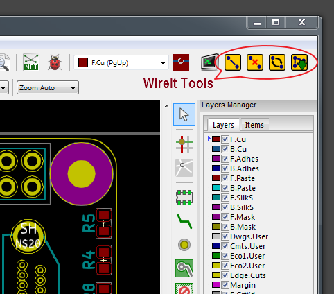

# WireIt Plugin

This PCBNEW plugin lets you add wires between pads on a PCB, delete them, and swap wires between pads.
This is helpful for physically connecting sets of related pins when doing
the layout of high pin-count packages such as FPGAs.

* Free software: MIT license

## Features

* Connect two or more pads to each other or to an existing net.
* Remove one or more pads from a net.
* Swap the nets connecting two pads.
* Output a file containing the changes made to the netlist.

## Installation

Just copy `WireIt.py` file and the `WireIt_icons` directory to the `kicad/share/kicad/scripting/plugins` directory.

## Usage

The plugin is started by pressing the `Tools => External Plugins... => WireIt` button.
This adds a button to the PCBNEW window for each of the four WireIt tools:

### The WireIt Tool

This tool is used to create an *airwire* between two or more pads.
It is used as follows:

1. Select one or more pads on the PCB using the shift-click mouse operation.
2. Click on the  button.

After clicking on the WireIt button, one of the following will happen:

* If all of the pads were unconnected, a dialog window will appear where you can
  type in the name of the new net that will connect them. Pressing the `OK`
  button will cause an airwire to appear between the selected pads.
  Pressing `Cancel` will abort the creation of the airwire.
* If one or more of the pads are already connected to the *same* net, then
  any unconnected pads will be added to that net. No dialog window for naming
  the net will appear because the net already has a name.
* If two or more of the pads are already connected to *different* nets, then
  an error will be raised because merging nets together is not allowed.

### The CutIt Tool

This tool is used to remove an airwire from one or more pads.
It is used as follows:

1. Select one or more pads on the PCB using the shift-click mouse operation.
2. Click on the  button.

After clicking on the CutIt button, any airwires atached to the selected pads
will be removed and the pads will become unconnected.

### The SwapIt Tool

This tool is used to swap the airwires connected to two pads.
It is used as follows:

1. Select exactly two pads using the shift-click mouse operation.
2. Click on the  button.

After clicking on the SwapIt button, the airwires attached to the two pads will
be exchanged with the first pad becoming attached to the net of the second pad
and vice-versa.

### The DumpIt Tool

This tool is used to write a file with a list of the changes made by the WireIt,
CutIt, and SwapIt tools. This is done by comparing the current PCB netlist
with the netlist that existed when the WireIt tools were first activated.

Clicking the  button causes a dialog window to appear where you can specify
the file to store the list of wiring changes. (You can type the file name, use
a file browser, or drag-and-drop a file onto the text field in the dialog window.)
Clicking the `OK` button writes a textual list of the pads whose wiring was
changed to the file. (Any previous contents of the file will be overwritten.)
Then you are responsible for manually backannotating the netlist changes into
the schematic associated with this PCB layout.
Clicking the `Cancel` button aborts the writing of the file.
 
### Example

The video below demonstrates the use of the WireIt tools:

## Credits

### Development Lead

* XESS Corp. <info@xess.com>

### Contributors

None yet. Why not be the first?

## History

### 0.1.0 (2018-06-19)

* First release.
